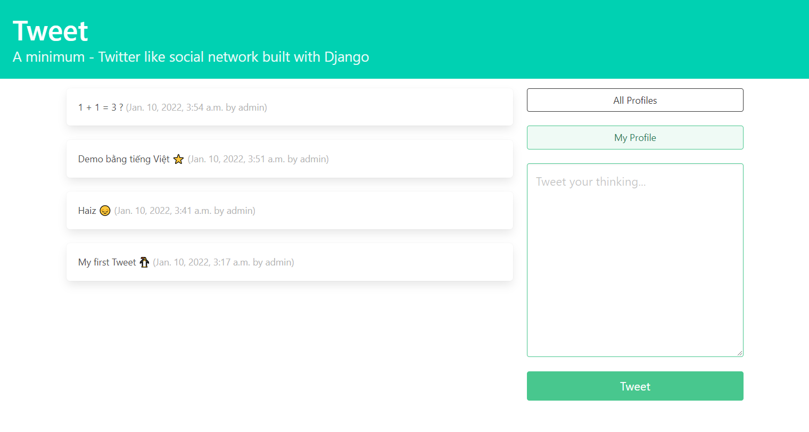

# Tweet - Minimum social network built with Django

This web app models the basic functionality of Twitter.

You can:

- **Post** short text-based messages
- **View** all users on the platform
- **Delete** your tweet
- **Follow** and unfollow other users
- **Inspect** a feed of messages from users that you follow

Reference to [instructions](https://realpython.com/django-social-network-1/) on _Real Python_ to build your own version of Dwitter.

## Setup

You can run the provided example project on your local machine by following the steps outlined below.

Create a new docker image:

```bash
docker-compose build
```

Run the container:

```bash
docker-compose up
```

Navigate to `http://localhost:8000/admin` and log in with your superuser credentials. You can create users through the Django admin and explore your social media platform with multiple users.
Login info:

- **username**: admin
- **password**: duongleha

Or create your user in `http://localhost:8000/accounts/signup`

##Screenshots

